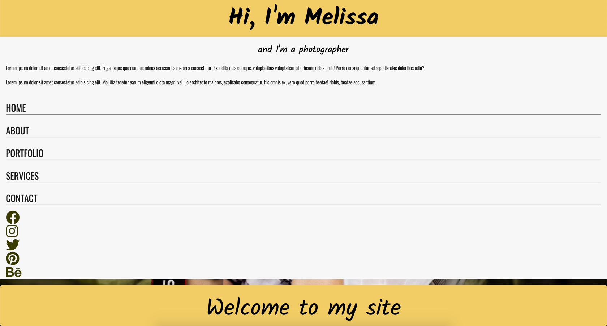

# Step ONE: Complete Flexbox Froggy game

Step one gives you the opportunity to learn more about flexbox and test your skills using the Flexbox Froggy game.  There are 24 levels. You will need to complete all 24 levels and submit a screenshot of you completing level 24. (We use the honor system that you completed this exercise since it really does not force you to go one level at a time).  You can find Flexbox Froggy at:

https://flexboxfroggy.com/

Upload your screenshot to your exercise directory and name the file appropriately.

# Set Two: Build a portfolio page with flexbox

This exercise gives you the chance to test your Flexbox knowledge by building a photography portfolio.

## Before you begin

Run the project by right-clicking on `index.html` in Visual Studio Code and selecting `Open with Live Server`. When you first run the project, it looks like this:



If you complete all of the steps in this exercise, your solution looks like this:


Make all of your changes for this exercise in `css/main.css`. You don't need to change the HTML markup to complete this exercise.

## Step One: Define the overall layout

The layout for this page consists of two panels: a left panel and a right panel. The left panel contains a bio, navigation, and social media links. The right panel displays an image and a welcome banner. The body style pushes the layout to full screen using `min-height: 100vh`, but it's missing something. You need to add one property to lay out the items in a row:

```css
body {
  margin: 0;
  padding: 0;
  min-height: 100vh;
  /* Photo by Andre Furtado on Unsplash */
  background: url(../img/andre-furtado-JtV6zyOZSrA-unsplash.jpg) left / cover
    no-repeat;
  /* add style here */
}
```

## Step Two: Add flex layout to the left panel

Add a flex layout to the left panel so the items stack on top of each other and take up a width (basis) of 35%:

```css
#left-panel {
  background-color: #f7f7f7;
  /* add styles here */
}
```

## Step Three: Add styles to social icons

Next, you need to add styles to the following class so that the social icons are in a row that stretch across the width of the left-panel and have the same amount of space between each of them:

```css
ul.social-icons {
  list-style-type: none;
  margin: 20px 20px;
  padding: 0;
  /* add styles here */
}
```

You also need to add a style to the nav so that it **grows** to take up the rest of the available space. This pushes the social media icons to the bottom of the left panel:

```css
nav {
  /* add style here */
}
```

## Step Four: Center welcome banner

Finally, you need to center the welcome banner in the middle of the right panel. There are four styles needed to achieve the desired effect:

```css
#right-panel {
  /* add styles here */
}
```

## Solution

If you completed all four steps, your solution looks like this:


